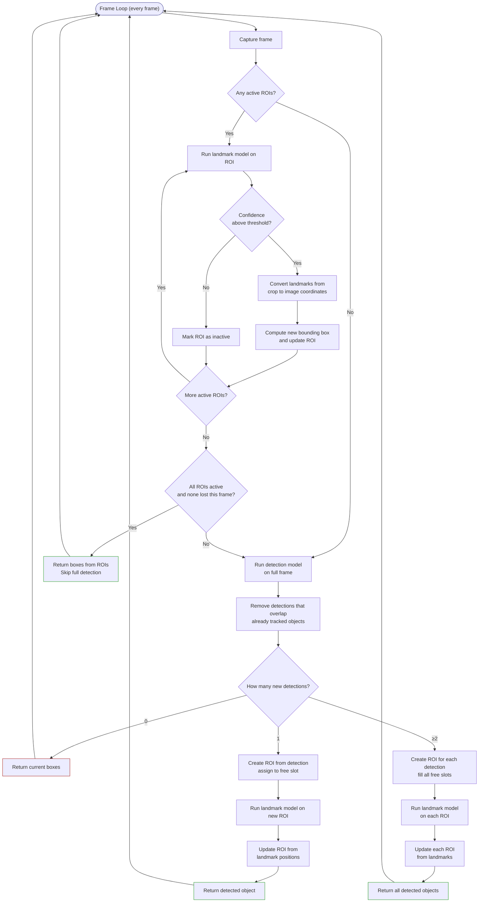

# Pipeline Flow

## Walkthrough

### 1. Processing Existing ROIs
For every active ROI slot, run the landmark model on the current crop:
- **Confidence above threshold** → convert landmarks to image coordinates, compute new bounding box, update ROI for next frame
- **Confidence too low** → mark slot free, trigger full detection on this frame

### 2. Skip Full Detection?
If **all** slots have active ROIs and none were lost this frame → return the boxes directly from the ROIs. Otherwise fall through to full-frame detection.

### 3. Full Detection + Branching
| Detections | What happens |
|------------|-------------|
| 0 | Return whatever is still active (likely nothing) |
| 1 | Create ROI from detection → fill one free slot → run landmark → object detected |
| ≥2 | Create ROI for each detection → fill all free slots → run landmark on each → all objects detected |

Detections that overlap an object already followed by an ROI are removed to avoid duplicate ROIs.

## Object Movement Behaviour

| Scenario | Result |
|----------|--------|
| Object moves within ROI | Landmarks converted to image coords → ROI re-centred each frame → ROI follows object |
| Object leaves ROI (confidence drops) | Slot freed → full detection runs same frame → new ROI created if re-detected |
| New object enters frame | Free slot exists → full detection picks it up → ROI created |
