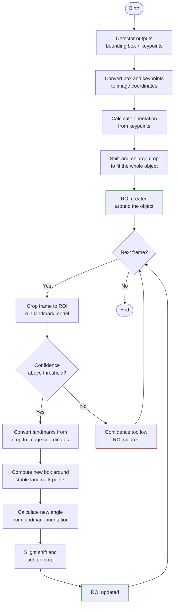

# ROI Lifecycle

## Birth - Detector Creates the ROI

A detection model outputs a bounding box and keypoints. The ROI is initialised by:

1. Converting box corners and keypoints to image coordinates
2. Calculating the object's orientation from a pair of keypoints
3. Shifting and scaling the ROI so the full object fits inside the crop

## Life - Frame-to-Frame Update

Each frame the landmark model runs on the ROI crop. If the confidence score stays above threshold:

1. The relative landmarks are converted to image coordinates
2. A new bounding box is computed from the most stable landmarks
3. A new orientation is calculated from the landmark positions
4. A small shift and scale produces the next frame's ROI

The ROI **translates, rotates, and resizes** every frame to follow the object.

## Death - Object Leaves the ROI

When the landmark model's confidence drops below threshold:

1. The ROI slot is freed
2. On the same frame, the detector runs to re-acquire the object (see `pipeline_flow.md`)

## Configuration Summary

| Phase | Shift X | Shift Y | Scale X | Scale Y | Purpose |
|-------|---------|---------|---------|---------|---------|
| Birth (Detection→ROI) | 0.0 | –0.5 | 2.6 | 2.6 | Capture full object from imprecise detector output |
| Update (Landmark→ROI) | 0.0 | –0.1 | 2.0 | 2.0 | Tight crop around known object position |
